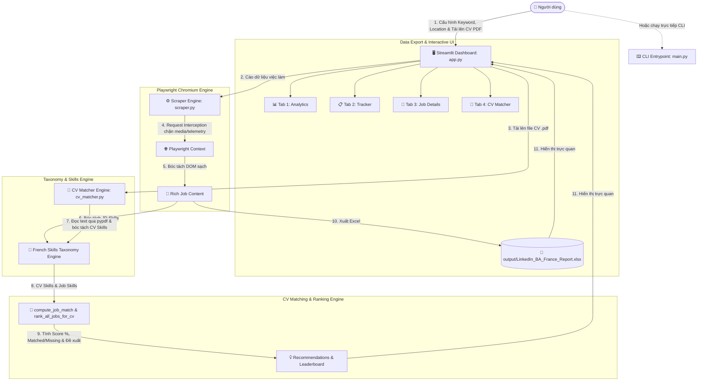

# 🏛️ TÀI LIỆU KIẾN TRÚC & TỔNG KẾT TOÀN DIỆN DỰ ÁN (ARCHITECT.MD)
> **Dự án:** LinkedIn Business Analyst Alternance Scraper & Tracker (France)  
> **Phiên bản hiện tại:** `v1.0.4` (Sprint 5 - Đánh Giá Độ Phù Hợp CV PDF & Gợi Ý Cải Thiện Hồ Sơ)  
> **Mục đích tài liệu:** Đóng gói toàn bộ kiến trúc, luồng hoạt động, cấu trúc mã nguồn, kinh nghiệm xử lý lỗi và hướng dẫn khởi chạy để bất kỳ thiết bị mới hoặc AI nào khi đọc tài liệu này đều có thể nắm bắt và tiếp tục phát triển 100% dự án ngay lập tức.

---

## 📑 MỤC LỤC
1. [Tổng Quan Dự Án (Overview & Objectives)](#1-tổng-quan-dự-án-overview--objectives)
2. [Sơ Đồ Kiến Trúc Hệ Thống (System Architecture)](#2-sơ-đồ-kiến-trúc-hệ-thống-system-architecture)
3. [Cấu Trúc Thư Mục & Vai Trò Từng File (Directory & File Structure)](#3-cấu-trúc-thư-mục--vai-trò-từng-file-directory--file-structure)
4. [Phân Tích Chi Tiết Các Module Mã Nguồn (Code Modules Breakdown)](#4-phân-tích-chi-tiết-các-module-mã-nguồn-code-modules-breakdown)
   - [4.1. Core Engine Scraper (`src/scraper.py`)](#41-core-engine-scraper-srcscraperpy)
   - [4.2. Web Dashboard UI (`src/app.py`)](#42-web-dashboard-ui-srcapppy)
   - [4.3. CV Matching & Recommendation Engine (`src/cv_matcher.py`)](#43-cv-matching--recommendation-engine-srccv_matcherpy)
   - [4.4. Browser Controller Wrapper (`src/browser.py`)](#44-browser-controller-wrapper-srcbrowserpy)
   - [4.5. CLI Entrypoint & Config (`src/main.py` & `src/config.py`)](#45-cli-entrypoint--config-srcmainpy--srcconfigpy)
5. [Các Giải Pháp Kỹ Thuật Đột Phá & Xử Lý Edge Cases (Technical Solutions)](#5-các-giải-pháp-kỹ-thuật-đột-phá--xử-lý-edge-cases-technical-solutions)
   - [5.1. Vượt rào cản Authwall/Modal LinkedIn không cần Login](#51-vượt-rào-cản-authwallmodal-linkedin-không-cần-login)
   - [5.2. Tối ưu hóa siêu tốc độ cào dữ liệu (153s -> 20s) & Bộ lọc Request Interception](#52-tối-ưu-hóa-siêu-tốc-độ-cào-dữ-liệu-153s---20s--bộ-lọc-request-interception)
   - [5.3. Thẻ công việc bản địa (Native Job & Company Details) thay thế Screenshot thô](#53-thẻ-công-việc-bản-địa-native-job--company-details-thay-thế-screenshot-thô)
   - [5.4. Trích xuất text PDF và Matching kỹ năng (Sprint 5)](#54-trích-xuất-text-pdf-và-matching-kỹ-năng-sprint-5)
   - [5.5. Chuẩn hóa & Nhận diện Kỹ năng tiếng Pháp (French BA Taxonomy)](#55-chuẩn-hóa--nhận-diện-kỹ-năng-tiếng-pháp-french-ba-taxonomy)
   - [5.6. Tinh chỉnh biểu đồ Plotly trực quan: Nhãn tỉ lệ trực tiếp, loại bỏ Tooltip đen](#56-tinh-chỉnh-biểu-đồ-plotly-trực-quan-nhãn-tỉ-lệ-trực-tiếp-loại-bỏ-tooltip-đen)
   - [5.7. Tạo báo cáo Excel tương tác cao cấp với OpenPyXL](#57-tạo-báo-cáo-excel-tương-tác-cao-cấp-với-openpyxl)
   - [5.8. Giải quyết triệt để tương thích Streamlit Cloud & Linux Containers](#58-giải-quyết-triệt-để-tương-thích-streamlit-cloud--linux-containers)
6. [Hướng Dẫn Cài Đặt & Chạy Trên Máy Mới (Deployment & Run Guide)](#6-hướng-dẫn-cài-đặt--chạy-trên-máy-mới-deployment--run-guide)
   - [6.1. Chạy trên Windows (Local)](#61-chạy-trên-windows-local)
   - [6.2. Chạy trên macOS / Linux](#62-chạy-trên-macos--linux)
   - [6.3. Triển khai lên Streamlit Cloud](#63-triển-khai-lên-streamlit-cloud)
7. [Lịch Sử Tiến Hóa Qua Các Sprint (Sprint Evolution History)](#7-lịch-sử-tiến-hóa-qua-các-sprint-sprint-evolution-history)
8. [Định Hướng Phát Triển Tiếp Theo (Future Roadmap)](#8-định-hướng-phát-triển-tiếp-theo-future-roadmap)

---

## 1. 🎯 TỔNG QUAN DỰ ÁN (Overview & Objectives)

### 1.1. Bối cảnh & Mục tiêu
Dự án được xây dựng nhằm giải quyết bài toán tìm kiếm, phân tích và tối ưu hóa cơ hội ứng tuyển (**Alternance / Stage / CDI**) cho vị trí **Business Analyst** trên thị trường Pháp (LinkedIn France). Đặc biệt, hệ thống tích hợp công cụ AI Matching so khớp trực tiếp CV (định dạng PDF) với các tin tuyển dụng để đưa ra khuyến nghị thực chiến.

### 1.2. Tính năng chính
1. **Tìm kiếm tự động thông minh:** Lọc các bài đăng tuyển dụng mới nhất trong vòng 24 giờ qua (`f_TPR=r86400`) theo từ khóa và vị trí địa lý tùy biến.
2. **Cơ chế bóc tách sâu siêu tốc (High-Performance Scraper):** Thu thập dữ liệu 10 bài đăng trong **15 - 30 giây**. Trích xuất Tiêu đề, Công ty, Địa điểm, Link LinkedIn, Loại hình hợp đồng, Cấp bậc, Ngành nghề, About the Company và About the Job.
3. **Phân tích kỹ năng chuyên nghiệp (NLP Skill Extraction):** Hệ thống phân loại kỹ năng chuẩn tiếng Pháp theo 4 nhóm: *Outils*, *Méthodologies*, *Soft Skills*, *Langues*.
4. **Đánh giá mức độ phù hợp CV & Khuyến nghị (CV PDF Matcher - Sprint 5):**
   - Đọc trực tiếp file CV dạng PDF của ứng viên qua `pypdf`.
   - Trích xuất toàn bộ kỹ năng của ứng viên và phân loại trực quan.
   - Xếp hạng bảng Leaderboard toàn bộ danh sách việc làm theo điểm tương thích (**Fit Score %**).
   - So sánh chi tiết: **Kỹ năng đã đáp ứng (Forces)** vs **Kỹ năng còn thiếu (Manquants)**.
   - Đưa ra lời khuyên cụ thể về từ khóa ATS, kinh nghiệm dự án và cách tùy chỉnh hồ sơ cho từng vị trí.
5. **Hệ thống Quản lý Ứng tuyển & Báo cáo Excel 2 Sheets:**
   - **Sheet 1 (`Job Listings`):** Bảng dữ liệu việc làm tích hợp sẵn các cột quản lý trạng thái, ngày nộp, liên hệ HR, ghi chú.
   - **Sheet 2 (`Top Skills Ranking`):** Thống kê tần suất xuất hiện và tỷ lệ phần trăm nhu cầu của từng kỹ năng.
6. **Dashboard Web Hiện đại (Streamlit + Plotly - 4 Tabs):**
   - **Tab 1:** 📊 Tableaux de Bord & Visualisations (Plotly với nhãn tỉ lệ `X/Total (Y%)`).
   - **Tab 2:** 📋 Suivi des Candidatures (Chỉnh sửa bảng tính `st.data_editor` và tải file Excel).
   - **Tab 3:** 📑 Fiche de Poste & Détails (Native Job & Company Details).
   - **Tab 4:** 🎯 Évaluation du CV & Matching (Bộ tải PDF, Leaderboard và đề xuất cá nhân hóa).

### 1.3. Công nghệ cốt lõi (Tech Stack)
- **Ngôn ngữ:** Python 3.11+
- **Tự động hóa trình duyệt:** Playwright 1.44.0+ (Chromium Engine)
- **Đọc PDF & Trích xuất văn bản:** PyPDF >= 4.0.0 (Thuần Python, không phụ thuộc C/C++)
- **Web UI & Trực quan hóa:** Streamlit >= 1.30.0, Plotly 5.18.0+
- **Xử lý dữ liệu & Báo cáo:** Pandas 2.2.2, OpenPyXL 3.1.2

---

## 2. 🏗️ SƠ ĐỒ KIẾN TRÚC HỆ THỐNG (System Architecture)



---

## 3. 📁 CẤU TRÚC THƯ MỤC & VAI TRÒ TỪNG FILE

```
Linkedin app/
│
├── .devcontainer/
│   └── devcontainer.json          # Cấu hình môi trường VS Code Codespaces / Docker container
│
├── data/                          # Thư mục dữ liệu thô
├── logs/
│   └── browser.log                # File ghi log vận hành
├── output/
│   ├── LinkedIn_BA_France_Report.xlsx  # Báo cáo Excel chính (2 sheets)
│   └── sample_cv_lucas_martin.pdf      # File CV PDF mẫu dùng để test
├── src/
│   ├── __init__.py
│   ├── app.py                     # [UI] Dashboard Streamlit 4 Tabs (Sprint 5: Tab CV Matcher)
│   ├── browser.py                 # [Wrapper] Class PlaywrightBrowser
│   ├── config.py                  # [Config] Hằng số cấu hình
│   ├── cv_matcher.py              # [AI Matcher] Đọc PDF, bóc tách kỹ năng CV, tính Fit Score & đề xuất
│   ├── main.py                    # [CLI] Khởi chạy độc lập dòng lệnh
│   └── scraper.py                 # [Core] Scraper hiệu năng cao, bóc tách kỹ năng & xuất Excel
│
├── Agent.md                       # [Rules] Triết lý kỹ sư Senior lười biếng (Ponytail)
├── packages.txt                   # Danh sách thư viện Linux (Debian) cho Playwright
├── README.md                      # Hướng dẫn sử dụng dự án (bản tiếng Pháp)
├── requirements.txt               # Danh sách thư viện Python (pypdf, streamlit, plotly...)
└── architect.md                   # [Tài liệu này] Kiến trúc toàn diện của dự án
```

---

## 4. 🔬 PHÂN TÍCH CHI TIẾT CÁC MODULE MÃ NGUỒN

### 4.1. Core Engine Scraper (`src/scraper.py`)
- Định nghĩa bộ từ điển `SKILL_MAP` tiếng Pháp với hơn 30 kỹ năng cốt lõi.
- Cơ chế cào dữ liệu siêu tốc bằng `context.route()` chặn media/telemetry và `wait_until="domcontentloaded"`.
- Bóc tách toàn diện trường dữ liệu: *About the job*, *About the company*, *Employment type*, *Seniority level*, *Industries*.
- Xuất báo cáo Excel với đầy đủ DataValidation dropdown, hyperlink và màu sắc nhận diện.

### 4.2. Web Dashboard UI (`src/app.py`)
Được chia thành 4 Tabs chuyên biệt:
- **Tab 1: 📊 Tableaux de Bord & Visualisations:** Biểu đồ Plotly với nhãn tỉ lệ `X/Total (Y%)`, tắt tooltip đen và ẩn modebar.
- **Tab 2: 📋 Suivi des Candidatures:** Bảng chỉnh sửa trực tiếp trạng thái ứng tuyển và nút tải file Excel tức thì.
- **Tab 3: 📑 Fiche de Poste & Détails:** Trình bày chi tiết công việc dạng thẻ văn bản cấu trúc bản địa.
- **Tab 4: 🎯 Évaluation du CV & Matching:** Bộ tải file CV PDF, thẻ tổng kết hồ sơ, bảng xếp hạng Leaderboard tất cả việc làm và bảng phân tích chuyên sâu từng bài tuyển dụng.

### 4.3. CV Matching & Recommendation Engine (`src/cv_matcher.py`)
Tuân thủ tuyệt đối triết lý [Agent.md](file:///c:/Users/Window/Desktop/Linkedin%20app/Agent.md) (tái sử dụng, không sinh code thừa):
- `extract_text_from_pdf(pdf_source)`: Đọc và trích xuất sạch văn bản từ tất cả các trang PDF bằng `pypdf`.
- `analyze_cv_skills(cv_text)`: Tái sử dụng `extract_skills_from_text` từ `scraper.py` để phát hiện và nhóm kỹ năng theo danh mục.
- `compute_job_match(cv_skills, job_skills, job_details)`:
  - Tính tập kỹ năng chung (`matched_skills`) và kỹ năng còn thiếu (`missing_skills`).
  - Tính điểm phù hợp: $\text{Score} = \min\left(100, \text{round}\left(\frac{|\text{Matched}|}{\max(1, |\text{Required}|)} \times 100\right)\right)$.
  - Tự động sinh danh sách lời khuyên hành động thực tế bằng tiếng Pháp: từ khóa ATS, cách diễn đạt kinh nghiệm thay thế và lưu ý cho hợp đồng Alternance/Stage.
- `rank_all_jobs_for_cv(cv_skills, jobs_data)`: Trả về danh sách xếp hạng tất cả công việc theo điểm phù hợp giảm dần.

### 4.4. Browser Controller Wrapper (`src/browser.py`)
Lớp bao gói Playwright OOP cho phép quản lý vòng đời trình duyệt.

### 4.5. CLI Entrypoint & Config (`src/main.py` & `src/config.py`)
Cung cấp lối vào cho việc chạy tự động qua terminal hoặc cron job.

---

## 5. 💡 CÁC GIẢI PHÁP KỸ THUẬT ĐỘT PHÁ & XỬ LÝ EDGE CASES

### 5.1. Vượt rào cản Authwall/Modal LinkedIn không cần Login
Sử dụng CSS Injection qua `page.evaluate()` để ẩn vĩnh viễn toàn bộ modal đăng nhập và mở khóa thanh cuộn.

### 5.2. Tối ưu hóa siêu tốc độ cào dữ liệu (153s -> 20s) & Bộ lọc Request Interception
Chặn tài nguyên `image`, `media`, `font`, `beacon` và các tracker telemetry; phối hợp `domcontentloaded` giúp hoàn thành 10 tin tuyển dụng chỉ trong 15 - 30 giây.

### 5.3. Thẻ công việc bản địa (Native Job & Company Details) thay thế Screenshot thô
Bóc tách trực tiếp text "About the job" và "About the company" thay vì chụp ảnh full-page, giải quyết triệt để lỗi font và banner che khuất.

### 5.4. Trích xuất text PDF và Matching kỹ năng (Sprint 5)
* **Thách thức:** File PDF có cấu trúc nhị phân phức tạp, nhiều thư viện yêu cầu cài đặt binary C++ nặng nề (như poppler hoặc tesseract).
* **Giải pháp:** Sử dụng thư viện thuần Python `pypdf` cực nhẹ, trích xuất text nhanh gọn theo stream byte, tương thích 100% không cần bất kỳ dependency cấp hệ điều hành nào. Tái sử dụng bộ từ điển tiếng Pháp `SKILL_MAP` để đồng bộ hoàn toàn giữa yêu cầu của JD và hồ sơ của ứng viên.

### 5.5. Chuẩn hóa & Nhận diện Kỹ năng tiếng Pháp (French BA Taxonomy)
Nhận diện song ngữ Anh - Pháp thông qua danh mục từ đồng nghĩa regex (VD: *Cahier des charges* / *User stories* -> *Recueil des besoins*).

### 5.6. Tinh chỉnh biểu đồ Plotly trực quan: Nhãn tỉ lệ trực tiếp, loại bỏ Tooltip đen
Đưa nhãn tỉ lệ `X/Total (Y%)` trực tiếp lên từng thanh, thêm `hoverinfo='skip'` và ẩn modebar.

### 5.7. Tạo báo cáo Excel tương tác cao cấp với OpenPyXL
Tích hợp Dropdown DataValidation, tự động tạo Hyperlink cho URL, định dạng màu sắc doanh nghiệp sang trọng.

### 5.8. Giải quyết triệt để tương thích Streamlit Cloud & Linux Containers
Cấu hình đầy đủ thư viện trong `packages.txt` và tự động cài đặt Chromium nếu thiếu.

---

## 6. 🚀 HƯỚNG DẪN CÀI ĐẶT & CHẠY TRÊN MÁY MỚI

### 6.1. Chạy trên Windows (Local Machine)
```powershell
cd "c:\path\to\Linkedin app"
python -m venv .venv
.\.venv\Scripts\python.exe -m pip install -U pip
.\.venv\Scripts\python.exe -m pip install -r requirements.txt
.\.venv\Scripts\python.exe -m playwright install chromium

# Khởi chạy giao diện Web Streamlit
.\.venv\Scripts\python.exe -m streamlit run src/app.py
```

### 6.2. Chạy trên macOS / Linux
```bash
cd /path/to/Linkedin\ app
python3 -m venv .venv
source .venv/bin/activate
pip install -U pip
pip install -r requirements.txt
playwright install chromium
streamlit run src/app.py
```

### 6.3. Triển khai lên Streamlit Cloud
1. Đẩy mã nguồn lên GitHub.
2. Đăng nhập vào [share.streamlit.io](https://share.streamlit.io/).
3. Chọn Repository, Branch: `sprint/05-cv-pdf-matching-and-recommendations`, Main file path: `src/app.py`.
4. Nhấn **Deploy**.

---

## 7. 📜 LỊCH SỬ TIẾN HÓA QUA CÁC SPRINT (Changelog)

| Phiên bản | Sprint | Tên gói tính năng & Nội dung hoàn thành |
| :--- | :--- | :--- |
| **v1.0.0** | **Sprint 1** | **Browser Automation & Core Scraper:** Xây dựng `PlaywrightBrowser`, cào bài tuyển dụng LinkedIn, bóc tách kỹ năng cơ bản, xuất Excel thô. |
| **v1.0.1** | **Sprint 2** | **Logging, Metadata & Application Tracking:** Bổ sung hệ thống ghi log `browser.log`, thiết lập các cột theo dõi ứng tuyển (Trạng thái, Ngày, Liên hệ HR, Ghi chú), cấu hình giao diện Streamlit cơ bản. |
| **v1.0.2** | **Sprint 3** | **Streamlit Cloud Deployment & Chromium Standardization:** Thay thế Edge bằng Chromium tiêu chuẩn, xử lý vấn đề `sudo` trên Cloud bằng `packages.txt`, tối ưu hóa cơ chế nhận diện headless theo OS. |
| **v1.0.3** | **Sprint 4** | **UX/UI Enhancement & Performance Optimization:** Tối ưu tốc độ cào (15-30s), thẻ chi tiết công việc bản địa, biểu đồ Plotly hiển thị nhãn tỉ lệ `X/Total (Y%)`, thanh tiến trình thời gian thực kèm ETA. |
| **v1.0.4** | **Sprint 5** | **CV PDF Matching & Tailored Recommendations:**<br>• Tích hợp `src/cv_matcher.py` đọc PDF và so khớp kỹ năng ứng viên với JD.<br>• Bổ sung **Tab 4 (Évaluation du CV & Matching)** trên Streamlit.<br>• Bảng xếp hạng Leaderboard toàn bộ việc làm theo điểm tương thích (Fit Score %).<br>• So sánh trực quan điểm mạnh (Forces) và điểm thiếu hụt (Manquants).<br>• Đưa ra gợi ý cải thiện hồ sơ cụ thể bằng tiếng Pháp theo từng vị trí tuyển dụng. |

---

## 8. 🔮 ĐỊNH HƯỚNG PHÁT TRIỂN TIẾP THEO (Future Roadmap)

1. **Tích hợp Trí tuệ Nhân tạo Đầy đủ (Generative AI Cover Letter):**
   - Sử dụng Google Gemini API để tự động sinh Thư xin việc (*Lettre de motivation*) tiếng Pháp chuẩn chỉnh dựa trên các điểm mạnh đã khớp giữa CV và JD.
2. **Hỗ trợ Đa Nền tảng Tuyển dụng (Multi-platform Aggregator):**
   - Mở rộng thêm Welcome to the Jungle, Indeed France, Apec.fr.
3. **Hệ thống Thông báo Tự động (Notification & Alert Webhook):**
   - Gửi cảnh báo việc làm mới hàng ngày về Telegram Bot hoặc Discord Webhook.

---
*Tài liệu được biên soạn và chuẩn hóa toàn diện phục vụ cho việc bàn giao và phát triển dự án.*
