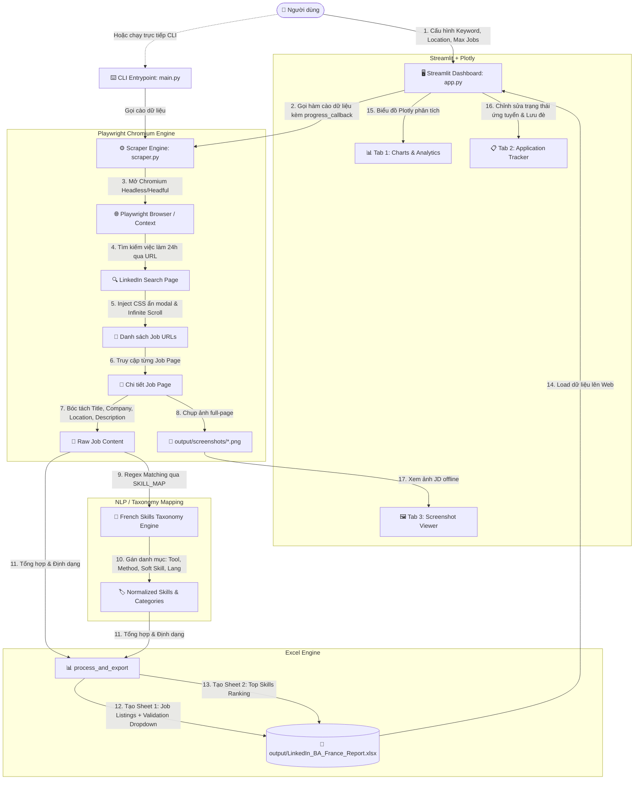

# 🏛️ TÀI LIỆU KIẾN TRÚC & TỔNG KẾT TOÀN DIỆN DỰ ÁN (ARCHITECT.MD)
> **Dự án:** LinkedIn Business Analyst Alternance Scraper & Tracker (France)  
> **Phiên bản hiện tại:** `v1.0.3` (Sprint 4)  
> **Mục đích tài liệu:** Đóng gói toàn bộ kiến trúc, luồng hoạt động, cấu trúc mã nguồn, kinh nghiệm xử lý lỗi và hướng dẫn khởi chạy để bất kỳ thiết bị mới hoặc AI nào khi đọc tài liệu này đều có thể nắm bắt và tiếp tục phát triển 100% dự án ngay lập tức.

---

## 📑 MỤC LỤC
1. [Tổng Quan Dự Án (Overview & Objectives)](#1-tổng-quan-dự-án-overview--objectives)
2. [Sơ Đồ Kiến Trúc Hệ Thống (System Architecture)](#2-sơ-đồ-kiến-trúc-hệ-thống-system-architecture)
3. [Cấu Trúc Thư Mục & Vai Trò Từng File (Directory & File Structure)](#3-cấu-trúc-thư-mục--vai-trò-từng-file-directory--file-structure)
4. [Phân Tích Chi Tiết Các Module Mã Nguồn (Code Modules Breakdown)](#4-phân-tích-chi-tiết-các-module-mã-nguồn-code-modules-breakdown)
   - [4.1. Core Engine Scraper (`src/scraper.py`)](#41-core-engine-scraper-srcscraperpy)
   - [4.2. Web Dashboard UI (`src/app.py`)](#42-web-dashboard-ui-srcapppy)
   - [4.3. Browser Controller Wrapper (`src/browser.py`)](#43-browser-controller-wrapper-srcbrowserpy)
   - [4.4. CLI Entrypoint & Config (`src/main.py` & `src/config.py`)](#44-cli-entrypoint--config-srcmainpy--srcconfigpy)
5. [Các Giải Pháp Kỹ Thuật Đột Phá & Xử Lý Edge Cases (Technical Solutions)](#5-các-giải-pháp-kỹ-thuật-đột-phá--xử-lý-edge-cases-technical-solutions)
   - [5.1. Vượt rào cản Authwall/Modal LinkedIn không cần Login](#51-vượt-rào-cản-authwallmodal-linkedin-không-cần-login)
   - [5.2. Chuẩn hóa & Nhận diện Kỹ năng tiếng Pháp (French BA Taxonomy)](#52-chuẩn-hóa--nhận-diện-kỹ-năng-tiếng-pháp-french-ba-taxonomy)
   - [5.3. Tạo báo cáo Excel tương tác cao cấp với OpenPyXL](#53-tạo-báo-cáo-excel-tương-tác-cao-cấp-với-openpyxl)
   - [5.4. Giải quyết triệt để tương thích Streamlit Cloud & Linux Containers](#54-giải-quyết-triệt-để-tương-thích-streamlit-cloud--linux-containers)
6. [Hướng Dẫn Cài Đặt & Chạy Trên Máy Mới (Deployment & Run Guide)](#6-hướng-dẫn-cài-đặt--chạy-trên-máy-mới-deployment--run-guide)
   - [6.1. Chạy trên Windows (Local)](#61-chạy-trên-windows-local)
   - [6.2. Chạy trên macOS / Linux](#62-chạy-trên-macos--linux)
   - [6.3. Triển khai lên Streamlit Cloud](#63-triển-khai-lên-streamlit-cloud)
7. [Lịch Sử Tiến Hóa Qua Các Sprint (Sprint Evolution History)](#7-lịch-sử-tiến-hóa-qua-các-sprint-sprint-evolution-history)
8. [Định Hướng Phát Triển Tiếp Theo (Future Roadmap)](#8-định-hướng-phát-triển-tiếp-theo-future-roadmap)

---

## 1. 🎯 TỔNG QUAN DỰ ÁN (Overview & Objectives)

### 1.1. Bối cảnh & Mục tiêu
Dự án được xây dựng nhằm giải quyết bài toán tìm kiếm và quản lý cơ hội việc làm/thực tập (**Alternance / Stage / CDI**) cho vị trí **Business Analyst** (hoặc bất kỳ vị trí nào khác) trên thị trường Pháp (LinkedIn France).

### 1.2. Tính năng chính
1. **Tìm kiếm tự động thông minh:** Lọc các bài đăng tuyển dụng mới nhất trong vòng 24 giờ qua (`f_TPR=r86400`) theo từ khóa và vị trí địa lý tùy biến.
2. **Cơ chế bóc tách sâu & Chụp ảnh toàn trang (Full-page Screenshots):** Tải nội dung từng JD, bóc tách đầy đủ Tiêu đề, Công ty, Địa điểm, Link gốc, Mô tả chi tiết và chụp ảnh màn hình lưu offline dưới `output/screenshots/`.
3. **Phân tích kỹ năng chuyên nghiệp (NLP Skill Extraction):** Hệ thống phân loại kỹ năng chuẩn tiếng Pháp (chia làm 4 nhóm: Công cụ Kỹ thuật, Phương pháp luận, Kỹ năng mềm, Ngôn ngữ).
4. **Hệ thống Quản lý Ứng tuyển & Báo cáo Excel 2 Sheets:**
   - **Sheet 1 (`Job Listings`):** Bảng dữ liệu việc làm tích hợp sẵn các cột quản lý trạng thái (*À postuler, Postulé, Entretien, Refusé, Offre reçue*), ngày nộp, liên hệ HR, ghi chú; kèm link hyperlink mở trực tiếp bài viết và ảnh screenshot.
   - **Sheet 2 (`Top Skills Ranking`):** Thống kê tần suất xuất hiện và tỷ lệ phần trăm nhu cầu của từng kỹ năng.
5. **Dashboard Web Hiện đại (Streamlit + Plotly):**
   - Biểu đồ phân tích trực quan tương tác cao (Top kỹ năng, cơ cấu nhóm kỹ năng, top nhà tuyển dụng, bản đồ phân bố địa lý).
   - Thanh tiến trình thời gian thực (Real-time Progress Bar) kèm dự tính thời gian hoàn thành (ETA).
   - Bộ chỉnh sửa dữ liệu ứng tuyển trực tiếp (`st.data_editor`) và lưu ngược vào Excel.
   - Trình xem trước ảnh chụp màn hình JD trực tiếp trên Web.
   - Nút tải trực tiếp file Excel báo cáo.

### 1.3. Công nghệ cốt lõi (Tech Stack)
- **Ngôn ngữ:** Python 3.11+
- **Tự động hóa trình duyệt:** Playwright 1.44.0 (Chromium Engine)
- **Web UI & Trực quan hóa:** Streamlit 1.30.1, Plotly 5.18.0+
- **Xử lý dữ liệu & Báo cáo:** Pandas 2.2.2, OpenPyXL 3.1.2
- **Môi trường & Container:** DevContainer (VS Code), Streamlit Cloud / Debian Bookworm

---

## 2. 🏗️ SƠ ĐỒ KIẾN TRÚC HỆ THỐNG (System Architecture)



---

## 3. 📁 CẤU TRÚC THƯ MỤC & VAI TRÒ TỪNG FILE

```
AI Agent/
│
├── .devcontainer/
│   └── devcontainer.json          # Cấu hình môi trường VS Code Codespaces / Docker container
│
├── data/                          # Thư mục lưu trữ dữ liệu thô (nếu có)
├── logs/
│   └── browser.log                # File ghi log vận hành của hệ thống scraper & browser
├── output/
│   ├── LinkedIn_BA_France_Report.xlsx  # Báo cáo Excel chính (2 sheets: Job Listings & Rankings)
│   └── screenshots/               # Chứa toàn bộ ảnh chụp màn hình full-page của từng JD
│       └── <ID>_<Company>_<Title>.png
├── screenshots/                   # Thư mục ảnh chụp bổ sung
├── src/
│   ├── __init__.py
│   ├── app.py                     # [UI] Dashboard Streamlit hoàn chỉnh (Sprint 4: Plotly, Data Editor, ETA)
│   ├── browser.py                 # [Wrapper] Class PlaywrightBrowser đóng gói các thao tác cơ bản
│   ├── config.py                  # [Config] Hằng số cấu hình (URL, timeout, paths, logging)
│   ├── main.py                    # [CLI] Điểm khởi chạy dòng lệnh độc lập không cần Web UI
│   └── scraper.py                 # [Core] Toàn bộ logic cào dữ liệu, bóc tách kỹ năng & xuất Excel
│
├── tests/                         # Thư mục chứa các unit/integration test trong tương lai
├── .gitignore                     # Cấu hình bỏ qua .venv, __pycache__, logs, outputs tạm
├── packages.txt                   # Danh sách thư viện hệ thống Linux (Debian) cho Playwright trên Cloud
├── README.md                      # Hướng dẫn sử dụng dự án (bản tiếng Pháp)
├── requirements.txt               # Danh sách thư viện Python phụ thuộc
└── architect.md                   # [Tài liệu này] Kiến trúc toàn diện của dự án
```

---

## 4. 🔬 PHÂN TÍCH CHI TIẾT CÁC MODULE MÃ NGUỒN

### 4.1. Core Engine Scraper (`src/scraper.py`)
File quan trọng nhất của hệ thống, bao gồm 4 khối chức năng chính:

#### A. Bộ từ điển kỹ năng tiếng Pháp (`SKILL_MAP` & `extract_skills_from_text`)
- Gồm hơn 30 kỹ năng cốt lõi của nghề Business Analyst tại Pháp, chia làm 4 nhóm:
  1. `Outil Technique / Logiciel`: SQL, Power BI, Excel, Jira, Python, Tableau, UML, BPMN, SAP, Salesforce, Confluence, MS Visio, PowerPoint, SharePoint, Snowflake, Alteryx, R.
  2. `Méthodologie / Framework`: Agile, Scrum, Kanban, Waterfall (Cycle en V), SAFe, DevOps.
  3. `Compétence Professionnelle / Soft Skill`: Gestion des parties prenantes, Recueil des besoins (User stories, cahier des charges), Gestion du changement, Analyse de données, Gestion de projet, Esprit d'analyse, Compétences en communication, Résolution de problèmes.
  4. `Langue`: Français, Anglais.
- Hàm `extract_skills_from_text(text)`: Sử dụng biểu thức chính quy (Regex) quét qua toàn bộ text mô tả công việc (JD), tự động chuẩn hóa từ đồng nghĩa (VD: `power bi` vs `powerbi`, `cycle en v` vs `waterfall`, `r` có boundary `\br\b` để tránh match sai).

#### B. Hàm thu thập dữ liệu chính (`scrape_linkedin`)
- **Chữ ký hàm:** `scrape_linkedin(keywords="alternance business analyst", location="France", max_jobs=10, progress_callback=None)`
- **Quy trình hoạt động:**
  1. **Khởi tạo Playwright Chromium:** Tự động phát hiện môi trường: Nếu chạy trên Linux / Cloud server -> dùng `headless=True`; Nếu chạy trên máy cá nhân Windows/Mac -> dùng `headless=False` (có thể xem trực tiếp).
  2. **Truy vấn tìm kiếm LinkedIn:** Tạo URL lọc bài đăng 24h qua (`&f_TPR=r86400`).
  3. **Bơm CSS (CSS Injection) diệt Modal:** Vô hiệu hóa và ẩn triệt để các modal bắt đăng nhập của LinkedIn (`.modal__overlay`, `.contextual-sign-in-modal`, `.authwall`), đồng thời mở khóa cuộn trang (`body { overflow: auto !important; }`).
  4. **Tự động đóng Cookie Banner:** Click nút *Accepter/Accept* nếu xuất hiện.
  5. **Cuộn trang thông minh (Adaptive Infinite Scroll):** Tự động tính số lần scroll dựa theo `max_jobs` yêu cầu (`scroll_times = min(8, max(2, (max_jobs // 4) + 1))`), bấm nút *See more jobs* nếu có.
  6. **Bóc tách danh sách Job Cards:** Thu thập toàn bộ link bài tuyển dụng duy nhất (loại bỏ query params rác).
  7. **Duyệt từng bài đăng tuyển dụng (Detail Scraping Loop):**
     - Mở trang JD chi tiết.
     - Inject CSS chống authwall.
     - Bấm nút *Show more* (`.show-more-less-html__button`) để lấy toàn bộ mô tả văn bản.
     - Lấy: Title, Company, Location, Description.
     - Trích xuất kỹ năng qua `extract_skills_from_text`.
     - Chụp ảnh toàn màn hình (`page.screenshot(full_page=True)`) lưu vào `output/screenshots/<ID>_<Company>_<Title>.png`.
     - Gọi `progress_callback` để cập nhật tiến trình và ETA cho giao diện Web.

#### C. Hàm định dạng và xuất báo cáo Excel (`process_and_export`)
- Chuyển đổi dữ liệu sang Pandas DataFrame.
- Thống kê xếp hạng tần suất kỹ năng (Rank, Skill Name, Category, Job Count, Occurrence Rate %).
- Tạo file Excel `output/LinkedIn_BA_France_Report.xlsx` với định dạng sang trọng:
  - **Header styling:** Nền xanh Navy `#1F4E78`, chữ trắng in đậm, canh giữa.
  - **Data Validation (Dropdown):** Cột *Statut Candidature* được nhúng dropdown chọn nhanh: `À postuler`, `Postulé`, `Entretien`, `Refusé`, `Offre reçue`.
  - **Hyperlink thông minh:** Cột *Job URL* dẫn link về LinkedIn; cột *Screenshot File* dẫn link mở ảnh chụp trực tiếp trên máy.
  - **Tự động căn chỉnh độ rộng cột:** Căn cứ độ dài ký tự tối đa của dữ liệu để cột hiển thị vừa vặn, không bị che chữ.

---

### 4.2. Web Dashboard UI (`src/app.py`)
Giao diện Streamlit được thiết kế theo phong cách UI/UX hiện đại:

1. **Header & Metric Cards:**
   - 4 thẻ tóm tắt số liệu nhanh: Tổng số JD thu thập, Kỹ năng #1 kèm tỷ lệ %, Nhà tuyển dụng hàng đầu, Khu vực tập trung nhiều việc nhất.
2. **Sidebar điều khiển & Dự toán thời gian (ETA Calculation):**
   - Ô nhập từ khóa (mặc định: `alternance business analyst`).
   - Ô nhập địa điểm (mặc định: `France`).
   - Thanh trượt (*Slider*) giới hạn số lượng bài đăng: 6 đến 30 việc (bước nhảy 2, mặc định 10).
   - Khung tính thời gian hoàn tất ước tính: `~2.3s * số lượng + 6s khởi động`.
   - Nút *"Lancer la collecte"* tích hợp cơ chế tự động cài đặt Chromium nếu phát hiện thiếu driver.
3. **Cấu trúc 3 Tabs chuyên sâu:**
   - **Tab 1: 📊 Tableaux de Bord & Visualisations (Plotly):**
     - *Biểu đồ cột ngang (Horizontal Bar Chart):* Top 15 kỹ năng được săn đón nhất, phân loại theo màu sắc danh mục.
     - *Biểu đồ tròn (Donut Chart):* Cơ cấu phân bổ theo 4 nhóm danh mục kỹ năng.
     - *Biểu đồ Top nhà tuyển dụng:* Thống kê các công ty đang tuyển nhiều nhất.
     - *Biểu đồ phân bố địa lý:* Tỷ lệ cơ hội việc làm theo thành phố/vùng.
   - **Tab 2: 📋 Suivi des Candidatures (Application Tracker):**
     - Bảng tương tác `st.data_editor` cho phép người dùng tick chọn trạng thái ứng tuyển, nhập ngày phỏng vấn, tên HR, ghi chú.
     - Nút *"Sauvegarder les modifications"* lưu đè trực tiếp các thay đổi vào file Excel.
     - Nút *"Télécharger le Rapport Excel"* tải file `.xlsx` về máy ngay trên trình duyệt.
   - **Tab 3: 🖼️ Visualiseur de Captures d'Écran:**
     - Hộp chọn (`st.selectbox`) danh sách công việc.
     - Hiển thị trực quan ảnh chụp full-page chất lượng cao để ứng viên xem lại mô tả công việc mọi lúc kể cả khi bài đăng trên LinkedIn đã bị gỡ.

---

### 4.3. Browser Controller Wrapper (`src/browser.py`)
- Đóng gói lớp `PlaywrightBrowser` làm lớp trung gian (Wrapper) chuẩn OOP cho Playwright:
  - `open_browser()`: Khởi tạo instance Chromium với cấu hình headless và timeout.
  - `open_page(url)`: Mở URL, lấy title và log kết quả.
  - `take_screenshot(filepath)`: Chụp ảnh full trang.
  - `close()`: Dọn dẹp tài nguyên (đóng page, context, browser và dừng tiến trình Playwright).

---

### 4.4. CLI Entrypoint & Config (`src/main.py` & `src/config.py`)
- **`src/config.py`**: Định nghĩa các giá trị mặc định (`HEADLESS = False`, `TIMEOUT = 30000`, `LOG_PATH = "logs/"`, `LOG_FILE = "browser.log"`).
- **`src/main.py`**: File chạy độc lập dành cho môi trường máy chủ hoặc lập lịch tự động (Cron job). Chạy tuần tự `configure_logging()` -> `scrape_linkedin()` -> `process_and_export()`.

---

## 5. 💡 CÁC GIẢI PHÁP KỸ THUẬT ĐỘT PHÁ & XỬ LÝ EDGE CASES

### 5.1. Vượt rào cản Authwall/Modal LinkedIn không cần Login
* **Thách thức:** LinkedIn thường xuyên bật popup yêu cầu đăng nhập/đăng ký (`.contextual-sign-in-modal`, `.authwall`, `#advocate-modal`), làm chặn cuộn trang và làm mờ nội dung bài viết khi cào dữ liệu không đăng nhập tài khoản.
* **Giải pháp:** Sau khi tải trang, Scraper thực hiện `page.evaluate()` bơm một đoạn CSS tùy biến trực tiếp vào DOM:
  ```css
  .modal__overlay, .top-level-modal-container, .contextual-sign-in-modal, .authwall, #advocate-modal {
      display: none !important;
      pointer-events: none !important;
  }
  body {
      overflow: auto !important;
  }
  ```
  Nhờ đó, toàn bộ modal biến mất ngay lập tức và trang web mở khóa cuộn bình thường, giúp Playwright đọc trọn vẹn văn bản và chụp ảnh sạch sẽ mà không bao giờ bị dính tài khoản bị khóa do bot.

### 5.2. Chuẩn hóa & Nhận diện Kỹ năng tiếng Pháp (French BA Taxonomy)
* **Thách thức:** Tin tuyển dụng ở Pháp sử dụng lẫn lộn cả tiếng Pháp và tiếng Anh (VD: *Cahier des charges* vs *Requirements*, *Conduite du changement* vs *Change management*, *Analyse des données* vs *Data analysis*).
* **Giải pháp:** Xây dựng danh mục kỹ năng hai ngôn ngữ (Bilingual regex matching). Mỗi kỹ năng được định nghĩa kèm danh sách alias (từ đồng nghĩa) regex:
  ```python
  "Recueil des besoins": (["requirement", "besoin", "cahier des charges", "spécification", "user story", "user stories"], "Compétence Professionnelle / Soft Skill")
  ```

### 5.3. Tạo báo cáo Excel tương tác cao cấp với OpenPyXL
* **Tính năng vượt trội:** Không chỉ xuất bảng tính thô như `to_csv()`, hàm `process_and_export` sử dụng OpenPyXL để:
  1. Thêm bộ chọn Dropdown (*DataValidation*) ngay trong ô Excel cho cột trạng thái ứng tuyển.
  2. Tự động biến đường link URL và file ảnh thành Hyperlink màu xanh có gạch chân, nhấp chuột vào là mở ngay.
  3. Kẻ viền (Border) mảnh, phối màu Header Navy Blue sang trọng, căn giữa các cột mã ID/ngày tháng và căn trái cột nội dung dài.

### 5.4. Giải quyết triệt để tương thích Streamlit Cloud & Linux Containers
* **Thách thức:** Khi đưa ứng dụng lên Cloud (Streamlit Cloud / Debian Linux), Playwright thường báo lỗi thiếu thư viện chia sẻ (`libnss3.so`, `libgbm.so`, v.v.) và không có quyền `sudo` để chạy `playwright install-deps`.
* **Giải pháp đã thực hiện và kiểm chứng:**
  1. Tạo file `packages.txt` chứa toàn bộ 18 gói thư viện C/C++ cấp OS cần thiết của Linux (như `libnss3`, `libgbm1`, `libasound2`, `libxfixes3`...). Streamlit Cloud sẽ tự động cài đặt các gói này qua `apt-get` trong giai đoạn build container.
  2. Bổ sung cơ chế phát hiện trình duyệt vật lý qua đường dẫn cache `~/.cache/ms-playwright/` trong `app.py`. Nếu chưa có, ứng dụng tự động chạy lệnh nền `sys.executable -m playwright install chromium` để tải browser driver một cách an toàn mà không làm sập app.
  3. Loại bỏ gói xung đột `libglib2.0-0` để đảm bảo tương thích hoàn hảo với môi trường Debian Bookworm.

---

## 6. 🚀 HƯỚNG DẪN CÀI ĐẶT & CHẠY TRÊN MÁY MỚI

Khi chuyển sang một máy tính mới (Windows, macOS hoặc Linux), chỉ cần thực hiện theo các bước sau:

### 6.1. Chạy trên Windows (Local Machine)

#### Bước 1: Mở PowerShell và di chuyển vào thư mục dự án
```powershell
cd "c:\path\to\AI Agent"
```

#### Bước 2: Tạo môi trường ảo Python & Cài đặt thư viện
```powershell
# Tạo môi trường ảo nếu chưa có
python -m venv .venv

# Nâng cấp pip và cài đặt thư viện
.\.venv\Scripts\python.exe -m pip install -U pip
.\.venv\Scripts\python.exe -m pip install -r requirements.txt

# Cài đặt trình duyệt Chromium cho Playwright
.\.venv\Scripts\python.exe -m playwright install chromium
```

#### Bước 3: Khởi chạy ứng dụng

* **Cách 1: Chạy Web Dashboard Streamlit (Khuyên dùng)**
  ```powershell
  .\.venv\Scripts\python.exe -m streamlit run src/app.py
  ```
  *(Trình duyệt sẽ tự động mở tại địa chỉ `http://localhost:8501`)*

* **Cách 2: Chạy Scraper bằng dòng lệnh CLI**
  ```powershell
  .\.venv\Scripts\python.exe src/main.py
  ```

---

### 6.2. Chạy trên macOS / Linux

```bash
# 1. Di chuyển vào thư mục
cd /path/to/AI\ Agent

# 2. Tạo môi trường ảo
python3 -m venv .venv
source .venv/bin/activate

# 3. Cài đặt thư viện
pip install -U pip
pip install -r requirements.txt

# 4. Cài đặt Playwright Chromium & dependencies hệ thống (nếu trên Linux)
playwright install chromium
# Nếu trên Ubuntu/Debian cần cài thêm thư viện hệ thống:
# playwright install-deps chromium

# 5. Khởi chạy Dashboard
streamlit run src/app.py
```

---

### 6.3. Triển khai lên Streamlit Cloud (Miễn phí)

1. Đẩy toàn bộ mã nguồn lên kho lưu trữ **GitHub**.
2. Đăng nhập vào [share.streamlit.io](https://share.streamlit.io/).
3. Chọn Repository, Branch: `main`, Main file path: `src/app.py`.
4. Nhấn **Deploy**. Hệ thống sẽ tự động đọc `packages.txt` và `requirements.txt` để cài đặt môi trường và khởi chạy ứng dụng.

---

## 7. 📜 LỊCH SỬ TIẾN HÓA QUA CÁC SPRINT (Changelog)

| Phiên bản | Sprint | Tên gói tính năng & Nội dung hoàn thành |
| :--- | :--- | :--- |
| **v1.0.0** | **Sprint 1** | **Browser Automation & Core Scraper:** Xây dựng `PlaywrightBrowser`, cào bài tuyển dụng LinkedIn, bóc tách kỹ năng cơ bản, chụp ảnh full-page, xuất Excel thô. |
| **v1.0.1** | **Sprint 2** | **Logging, Metadata & Application Tracking:** Bổ sung hệ thống ghi log `browser.log`, thiết lập các cột theo dõi ứng tuyển (Trạng thái, Ngày, Liên hệ HR, Ghi chú), cấu hình giao diện Streamlit cơ bản. |
| **v1.0.2** | **Sprint 3** | **Streamlit Cloud Deployment & Chromium Standardization:** Thay thế Edge bằng Chromium tiêu chuẩn, xử lý vấn đề `sudo` trên Cloud bằng `packages.txt`, tối ưu hóa cơ chế nhận diện headless theo OS. |
| **v1.0.3** | **Sprint 4** | **UX/UI Enhancement, Visual Analytics & Performance:** Bổ sung biểu đồ Plotly tương tác, thanh tiến trình thời gian thực kèm ETA, thanh trượt giới hạn số lượng tin (6-30 jobs), nút tải trực tiếp file Excel, tối ưu hóa tốc độ cào. |

---

## 8. 🔮 ĐỊNH HƯỚNG PHÁT TRIỂN TIẾP THEO (Future Roadmap)

Dành cho các phiên bản tiếp theo (**v1.1.0+** / Sprint 5 & 6):

1. **Tích hợp Trí tuệ Nhân tạo (LLM / AI Job Matching):**
   - Sử dụng OpenAI API hoặc Google Gemini để đối chiếu CV của ứng viên với từng JD được cào về.
   - Chấm điểm mức độ phù hợp (*Fit Score: 0-100%*) và gợi ý chỉnh sửa CV / viết Cover Letter (Lettre de motivation) tự động bằng tiếng Pháp.
2. **Hỗ trợ Đa Nền tảng Tuyển dụng (Multi-platform Aggregator):**
   - Mở rộng thêm module cào dữ liệu từ các trang tuyển dụng phổ biến tại Pháp: **Welcome to the Jungle**, **Indeed France**, **Apec.fr**, **JobTeaser**.
3. **Hệ thống Thông báo Tự động (Notification & Alert Webhook):**
   - Tích hợp gửi thông báo về Telegram Bot hoặc Discord Webhook mỗi buổi sáng khi có tin tuyển dụng mới đạt điểm phù hợp cao.
4. **Bộ lọc nâng cao (Advanced Filters):**
   - Lọc theo mức lương ước tính, chính sách làm việc từ xa (Remote / Hybride / Présentiel), thời hạn hợp đồng (12 tháng / 24 tháng).

---
*Tài liệu được biên soạn tự động và chuẩn hóa phục vụ cho việc bàn giao và kế thừa dự án.*
