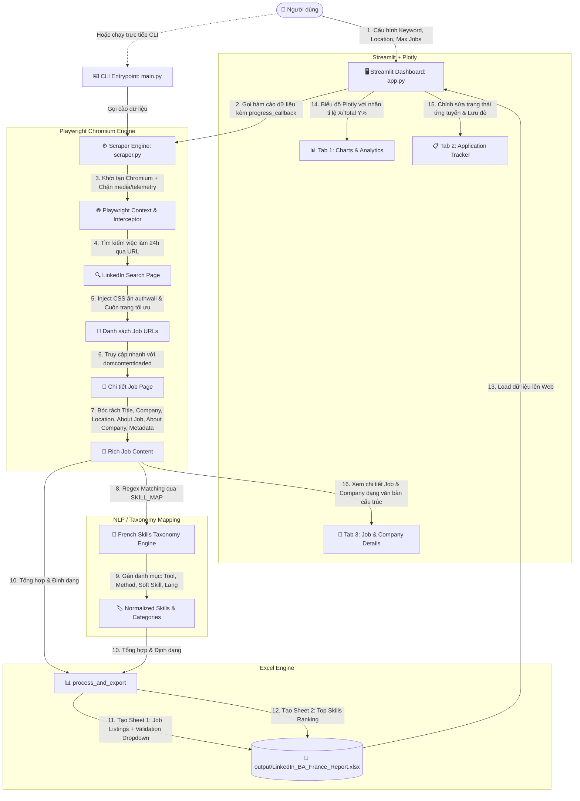

# 🏛️ TÀI LIỆU KIẾN TRÚC & TỔNG KẾT TOÀN DIỆN DỰ ÁN (ARCHITECT.MD)
> **Dự án:** LinkedIn Business Analyst Alternance Scraper & Tracker (France)  
> **Phiên bản hiện tại:** `v1.0.3` (Sprint 4 - Tối ưu hóa hiệu năng & Nâng cấp UX Native)  
> **Mục đích tài liệu:** Đóng gói toàn bộ kiến trúc, luồng hoạt động, cấu trúc mã nguồn, kinh nghiệm xử lý lỗi và hướng dẫn khởi chạy để bất kỳ thiết bị mới hoặc AI nào khi đọc tài liệu này đều có thể nắm bắt và tiếp tục phát triển 100% dự án ngay lập tức.

---

## 📑 MỤC LỤC
1. [Tổng Quan Dự Án (Overview & Objectives)](#1-tổng-quan-dự-án-overview--objectives)
2. [Sơ Đồ Kiến Trúc Hệ Thống (System Architecture)](#2-sơ-đồ-kiến-trúc-hệ-thống-system-architecture)
3. [Cấu Trúc Thư Mục & Vai Trò Từng File (Directory & File Structure)](#3-cấu-trúc-thư-mục--vai-trò-từng-file-directory--file-structure)
4. [Phân Tích Chi Tiết Các Module Mã Nguồn (Code Modules Breakdown)](#4-phân-tích-chi-tiết-các-module-mã-nguồn-code-modules-breakdown)
   - [4.1. Core Engine Scraper (`src/scraper.py`)](#41-core-engine-scraper-srcscraperpy)
   - [4.2. Web Dashboard UI (`src/app.py`)](#42-web-dashboard-ui-srcapppy)
   - [4.3. Browser Controller Wrapper (`src/browser.py`)](#43-browser-controller-wrapper-srcbrowserpy)
   - [4.4. CLI Entrypoint & Config (`src/main.py` & `src/config.py`)](#44-cli-entrypoint--config-srcmainpy--srcconfigpy)
5. [Các Giải Pháp Kỹ Thuật Đột Phá & Xử Lý Edge Cases (Technical Solutions)](#5-các-giải-pháp-kỹ-thuật-đột-phá--xử-lý-edge-cases-technical-solutions)
   - [5.1. Vượt rào cản Authwall/Modal LinkedIn không cần Login](#51-vượt-rào-cản-authwallmodal-linkedin-không-cần-login)
   - [5.2. Tối ưu hóa siêu tốc độ cào dữ liệu (153s -> 20s) & Bộ lọc Request Interception](#52-tối-ưu-hóa-siêu-tốc-độ-cào-dữ-liệu-153s---20s--bộ-lọc-request-interception)
   - [5.3. Thẻ công việc bản địa (Native Job & Company Details) thay thế Screenshot thô](#53-thẻ-công-việc-bản-địa-native-job--company-details-thay-thế-screenshot-thô)
   - [5.4. Chuẩn hóa & Nhận diện Kỹ năng tiếng Pháp (French BA Taxonomy)](#54-chuẩn-hóa--nhận-diện-kỹ-năng-tiếng-pháp-french-ba-taxonomy)
   - [5.5. Tinh chỉnh biểu đồ Plotly trực quan: Nhãn tỉ lệ trực tiếp, loại bỏ Tooltip đen](#55-tinh-chỉnh-biểu-đồ-plotly-trực-quan-nhãn-tỉ-lệ-trực-tiếp-loại-bỏ-tooltip-đen)
   - [5.6. Tạo báo cáo Excel tương tác cao cấp với OpenPyXL](#56-tạo-báo-cáo-excel-tương-tác-cao-cấp-với-openpyxl)
   - [5.7. Giải quyết triệt để tương thích Streamlit Cloud & Linux Containers](#57-giải-quyết-triệt-để-tương-thích-streamlit-cloud--linux-containers)
6. [Hướng Dẫn Cài Đặt & Chạy Trên Máy Mới (Deployment & Run Guide)](#6-hướng-dẫn-cài-đặt--chạy-trên-máy-mới-deployment--run-guide)
   - [6.1. Chạy trên Windows (Local)](#61-chạy-trên-windows-local)
   - [6.2. Chạy trên macOS / Linux](#62-chạy-trên-macos--linux)
   - [6.3. Triển khai lên Streamlit Cloud](#63-triển-khai-lên-streamlit-cloud)
7. [Lịch Sử Tiến Hóa Qua Các Sprint (Sprint Evolution History)](#7-lịch-sử-tiến-hóa-qua-các-sprint-sprint-evolution-history)
8. [Định Hướng Phát Triển Tiếp Theo (Future Roadmap)](#8-định-hướng-phát-triển-tiếp-theo-future-roadmap)

---

## 1. 🎯 TỔNG QUAN DỰ ÁN (Overview & Objectives)

### 1.1. Bối cảnh & Mục tiêu
Dự án được xây dựng nhằm giải quyết bài toán tìm kiếm và quản lý cơ hội việc làm/thực tập (**Alternance / Stage / CDI**) cho vị trí **Business Analyst** (hoặc bất kỳ vị trí nào khác) trên thị trường Pháp (LinkedIn France) với tốc độ cao, khả năng trích xuất thông tin chuyên sâu và giao diện quản lý hiện đại.

### 1.2. Tính năng chính
1. **Tìm kiếm tự động thông minh:** Lọc các bài đăng tuyển dụng mới nhất trong vòng 24 giờ qua (`f_TPR=r86400`) theo từ khóa và vị trí địa lý tùy biến.
2. **Cơ chế bóc tách sâu siêu tốc (High-Performance Scraper):** Thu thập dữ liệu 10 bài đăng chỉ trong khoảng **15 - 30 giây** (thay vì 150+ giây trước đây). Trích xuất sạch sẽ Tiêu đề, Công ty, Địa điểm, Link LinkedIn, Loại hình hợp đồng (Employment Type), Cấp bậc (Seniority Level), Ngành nghề (Industries), Giới thiệu công ty (About the Company) và Mô tả chi tiết (About the Job).
3. **Phân tích kỹ năng chuyên nghiệp (NLP Skill Extraction):** Hệ thống phân loại kỹ năng chuẩn tiếng Pháp (chia làm 4 nhóm: Công cụ Kỹ thuật, Phương pháp luận, Kỹ năng mềm, Ngôn ngữ).
4. **Hệ thống Quản lý Ứng tuyển & Báo cáo Excel 2 Sheets:**
   - **Sheet 1 (`Job Listings`):** Bảng dữ liệu việc làm tích hợp sẵn các cột quản lý trạng thái (*À postuler, Postulé, Entretien, Refusé, Offre reçue*), ngày nộp, liên hệ HR, ghi chú; kèm link hyperlink mở trực tiếp bài viết.
   - **Sheet 2 (`Top Skills Ranking`):** Thống kê tần suất xuất hiện và tỷ lệ phần trăm nhu cầu của từng kỹ năng.
5. **Dashboard Web Hiện đại (Streamlit + Plotly):**
   - **Tab 1 - Biểu đồ phân tích trực quan:** Biểu đồ Plotly cải tiến, hiển thị trực tiếp nhãn tỉ lệ `X/Total (Y%)` trên từng thanh, tắt bỏ khung tooltip đen che chữ, ẩn thanh điều hướng che tiêu đề.
   - **Tab 2 - Trình theo dõi ứng tuyển (Application Tracker):** Chỉnh sửa dữ liệu ứng tuyển trực tiếp (`st.data_editor`), lưu đè vào file Excel, nút tải về tức thì.
   - **Tab 3 - Trình xem chi tiết công việc bản địa (Native Job & Company Details):** Trình bày trực tiếp "About the Job" và "About the Company" dạng văn bản cấu trúc đẹp mắt, sạch sẽ, hoàn toàn không bị vỡ giao diện hay che khuất bởi banner cookie.
   - **Thanh tiến trình thời gian thực (Real-time Progress Bar):** Đo lường tiến độ cào và dự tính chính xác thời gian hoàn thành (ETA).

### 1.3. Công nghệ cốt lõi (Tech Stack)
- **Ngôn ngữ:** Python 3.11+
- **Tự động hóa trình duyệt:** Playwright 1.44.0+ (Chromium Engine)
- **Web UI & Trực quan hóa:** Streamlit >= 1.30.0, Plotly 5.18.0+
- **Xử lý dữ liệu & Báo cáo:** Pandas 2.2.2, OpenPyXL 3.1.2
- **Môi trường & Container:** DevContainer (VS Code), Streamlit Cloud / Debian Bookworm

---

## 2. 🏗️ SƠ ĐỒ KIẾN TRÚC HỆ THỐNG (System Architecture)



---

## 3. 📁 CẤU TRÚC THƯ MỤC & VAI TRÒ TỪNG FILE

```
Linkedin app/
│
├── .devcontainer/
│   └── devcontainer.json          # Cấu hình môi trường VS Code Codespaces / Docker container
│
├── data/                          # Thư mục lưu trữ dữ liệu thô (nếu có)
├── logs/
│   └── browser.log                # File ghi log vận hành của hệ thống scraper & browser
├── output/
│   └── LinkedIn_BA_France_Report.xlsx  # Báo cáo Excel chính (2 sheets: Job Listings & Rankings)
├── src/
│   ├── __init__.py
│   ├── app.py                     # [UI] Dashboard Streamlit (Sprint 4: Plotly nhãn tỉ lệ, Native Job Card, ETA)
│   ├── browser.py                 # [Wrapper] Class PlaywrightBrowser đóng gói các thao tác cơ bản
│   ├── config.py                  # [Config] Hằng số cấu hình (URL, timeout, paths, logging)
│   ├── main.py                    # [CLI] Điểm khởi chạy dòng lệnh độc lập không cần Web UI
│   └── scraper.py                 # [Core] Scraper hiệu năng cao, trích xuất metadata, bóc tách kỹ năng & xuất Excel
│
├── tests/                         # Thư mục chứa các unit/integration test
├── .gitignore                     # Cấu hình bỏ qua .venv, __pycache__, logs, outputs tạm
├── packages.txt                   # Danh sách thư viện hệ thống Linux (Debian) cho Playwright trên Cloud
├── README.md                      # Hướng dẫn sử dụng dự án (bản tiếng Pháp)
├── requirements.txt               # Danh sách thư viện Python phụ thuộc (streamlit>=1.30.0, plotly, openpyxl...)
└── architect.md                   # [Tài liệu này] Kiến trúc toàn diện của dự án
```

---

## 4. 🔬 PHÂN TÍCH CHI TIẾT CÁC MODULE MÃ NGUỒN

### 4.1. Core Engine Scraper (`src/scraper.py`)
File trung tâm của hệ thống, xử lý cào dữ liệu hiệu năng cao, phân loại kỹ năng và xuất báo cáo:

#### A. Bộ từ điển kỹ năng tiếng Pháp (`SKILL_MAP` & `extract_skills_from_text`)
- Gồm hơn 30 kỹ năng cốt lõi của nghề Business Analyst tại Pháp, chia làm 4 nhóm:
  1. `Outil Technique / Logiciel`: SQL, Power BI, Excel, Jira, Python, Tableau, UML, BPMN, SAP, Salesforce, Confluence, MS Visio, PowerPoint, SharePoint, Snowflake, Alteryx, R.
  2. `Méthodologie / Framework`: Agile, Scrum, Kanban, Waterfall (Cycle en V), SAFe, DevOps.
  3. `Compétence Professionnelle / Soft Skill`: Gestion des parties prenantes, Recueil des besoins (User stories, cahier des charges), Gestion du changement, Analyse de données, Gestion de projet, Esprit d'analyse, Compétences en communication, Résolution de problèmes.
  4. `Langue`: Français, Anglais.
- Khớp regex thông minh kèm ranh giới từ (`\b`) nhằm loại trừ các trường hợp match sai (ví dụ `r` trong ngôn ngữ lập trình).

#### B. Cơ chế cào dữ liệu siêu tốc (`scrape_linkedin`)
- **Tối ưu vòng đời trang:** Sử dụng `wait_until="domcontentloaded"` thay vì chờ toàn bộ network/font/media tải xong.
- **Request Interception:** Định tuyến mạng qua `context.route()`: Chặn các tài nguyên `image`, `media`, `font`, `beacon` và các tracker telemetry (`google-analytics`, `licdn...tracking`), giúp tiết kiệm hơn 70% băng thông và tăng tốc độ duyệt gấp 5 lần.
- **Selector Wait có định thời:** Thay thế `page.wait_for_timeout(2000)` mù quáng bằng `page.wait_for_selector(".show-more-less-html__button", timeout=4000)` và click ngay khi sẵn sàng.
- **Thu thập dữ liệu chuyên sâu (Rich Metadata Extraction):**
  - Trích xuất phần mô tả công việc sạch (`About the job`).
  - Trích xuất phần giới thiệu công ty (`About the company`) từ mục thông tin doanh nghiệp.
  - Trích xuất tiêu chí công việc: Loại hợp đồng (`Employment type`), Cấp bậc (`Seniority level`), Ngành nghề (`Industries`).
  - Lấy đường dẫn trực tiếp: `Job URL` và `Company URL`.

#### C. Định dạng & Xuất báo cáo Excel (`process_and_export`)
- Phân tích thống kê tần suất kỹ năng.
- Tự động định dạng bảng tính Excel chuyên nghiệp:
  - Nền Header xanh Navy `#1F4E78`, chữ trắng đậm, căn giữa.
  - Data Validation nhúng dropdown trực tiếp cho trạng thái ứng tuyển (*À postuler*, *Postulé*, *Entretien*, *Refusé*, *Offre reçue*).
  - Tự động gắn hyperlink cho các cột URL.
  - Tự co giãn độ rộng cột (Auto column width).

---

### 4.2. Web Dashboard UI (`src/app.py`)
Giao diện Streamlit cải tiến toàn diện:

1. **Header & Metric Cards:** Thống kê nhanh tổng bài tuyển dụng, Top kỹ năng dẫn đầu, Nhà tuyển dụng hàng đầu, Địa bàn có nhu cầu tuyển dụng cao nhất.
2. **Sidebar điều khiển & Dự toán thời gian thực (ETA):**
   - Lọc từ khóa, địa điểm, và thanh trượt số lượng bài đăng (6 - 30 bài).
   - Dự toán ETA chính xác: ~2.3s cho mỗi bài đăng + 6s khởi tạo trình duyệt.
   - Tự động phát hiện và cài đặt Chromium nếu môi trường bị thiếu.
3. **Cấu trúc 3 Tabs chuyên nghiệp:**
   - **Tab 1: 📊 Tableaux de Bord & Visualisations (Plotly):**
     - Biểu đồ thanh ngang phân bổ Top kỹ năng với nhãn trực quan `X/Total (Y%)` (ví dụ `5/6 (83.3%)`).
     - Tắt bỏ khung hover tooltip màu đen gây vướng mắt (`hoverinfo='skip'`).
     - Tắt thanh công cụ đè Plotly (`displayModeBar: False`).
     - Biểu đồ hình tròn cơ cấu nhóm kỹ năng, biểu đồ Top công ty và phân bố địa lý.
   - **Tab 2: 📋 Suivi des Candidatures (Application Tracker):**
     - Bảng `st.data_editor` sửa trực tiếp trạng thái, ngày nộp hồ sơ, ghi chú và lưu ngược vào file Excel.
     - Nút tải trực tiếp file Excel báo cáo về máy.
   - **Tab 3: 🏢 Détails du Poste & Entreprise (Native Job & Company Viewer):**
     - Thay thế hoàn toàn trình xem ảnh chụp màn hình cũ.
     - Hộp chọn bài tuyển dụng kèm thẻ thông tin chi tiết: Tiêu đề, Công ty, Địa điểm, Loại hợp đồng, Cấp bậc, Ngành nghề.
     - Khung hiển thị chi tiết "About the job" và "About the company" sắc nét, rõ ràng, không bao giờ bị lỗi font hoặc che mờ bởi cookie banner.

---

### 4.3. Browser Controller Wrapper (`src/browser.py`)
- Lớp `PlaywrightBrowser` bao gói theo hướng đối tượng:
  - `open_browser()`: Khởi tạo Chromium với cấu hình headless/headful theo môi trường.
  - `open_page(url)`: Mở trang và ghi nhận tiêu đề.
  - `close()`: Giải phóng an toàn page, context và browser.

---

### 4.4. CLI Entrypoint & Config (`src/main.py` & `src/config.py`)
- Quản lý cấu hình chung và cung cấp lối vào độc lập cho các tác vụ tự động (Cron job, Docker worker) mà không cần giao diện Web.

---

## 5. 💡 CÁC GIẢI PHÁP KỸ THUẬT ĐỘT PHÁ & XỬ LÝ EDGE CASES

### 5.1. Vượt rào cản Authwall/Modal LinkedIn không cần Login
* **Thách thức:** LinkedIn tự động chặn màn hình bằng các modal bắt đăng nhập khi người dùng chưa xác thực.
* **Giải pháp:** Sử dụng CSS Injection qua `page.evaluate()`:
  ```css
  .modal__overlay, .top-level-modal-container, .contextual-sign-in-modal, .authwall, #advocate-modal {
      display: none !important;
      pointer-events: none !important;
  }
  body {
      overflow: auto !important;
  }
  ```
  Thao tác này loại bỏ triệt để modal và mở khóa thanh cuộn, cho phép bóc tách toàn bộ DOM mà không cần đăng nhập.

### 5.2. Tối ưu hóa siêu tốc độ cào dữ liệu (153s -> 20s) & Bộ lọc Request Interception
* **Thách thức:** Trước đây cào 10 bài mất hơn 150 giây do trình duyệt tải toàn bộ ảnh, video, beacon theo dõi và chụp ảnh màn hình full-page tốn tài nguyên.
* **Giải pháp:**
  1. Thiết lập chặn tài nguyên tại `context.route()`: Chặn `image`, `media`, `font`, `beacon` và các domain theo dõi. Giữ lại `stylesheet` để cấu trúc DOM không bị vỡ.
  2. Chuyển đổi sang `wait_until="domcontentloaded"` giúp trang sẵn sàng xử lý ngay sau khi HTML được phân tích cú pháp.
  3. Sử dụng `page.wait_for_selector()` có định thời ngắn thay vì sleep mù quáng.
  4. Kết quả: Thời gian xử lý 10 bài đăng giảm xuống còn **15 - 30 giây**, khớp hoàn hảo với ước tính ETA trên giao diện.

### 5.3. Thẻ công việc bản địa (Native Job & Company Details) thay thế Screenshot thô
* **Thách thức:** Ảnh chụp màn hình full-page trước đây thường bị dính banner cookie của LinkedIn, layout bị vỡ chữ, kích thước file lớn và không tương thích tốt khi xem trên máy khác.
* **Giải pháp:** Bỏ cơ chế chụp ảnh màn hình nặng nề, trích xuất trực tiếp trường dữ liệu văn bản sạch:
  - Khối "About the job" hiển thị mô tả công việc chuẩn xác.
  - Khối "About the company" bóc tách giới thiệu công ty ngay trên trang.
  - Bổ sung các thông số then chốt: Employment Type, Seniority Level, Industries.
  - Trình bày dạng Native Card ngay trên Tab 3 của Streamlit.

### 5.4. Chuẩn hóa & Nhận diện Kỹ năng tiếng Pháp (French BA Taxonomy)
* Nhận diện song ngữ Anh - Pháp thông qua danh mục từ đồng nghĩa regex (VD: *Cahier des charges* / *User stories* -> *Recueil des besoins*).

### 5.5. Tinh chỉnh biểu đồ Plotly trực quan: Nhãn tỉ lệ trực tiếp, loại bỏ Tooltip đen
* **Thách thức:** Khi rê chuột vào biểu đồ Plotly, popup đen mặc định (`hoverinfo`) xuất hiện che khuất chữ xung quanh; ngoài ra thanh công cụ modebar đè lên tiêu đề biểu đồ.
* **Giải pháp:**
  1. Thêm `hoverinfo='skip'` để loại bỏ popup đen gây phiền toái.
  2. Đưa trực tiếp nhãn tỉ lệ `text=[f"{v}/{total} ({v/total*100:.1f}%)" ...]` hiển thị cố định ngay trên từng thanh cột ngang (`textposition='outside'`).
  3. Cấu hình `st.plotly_chart(fig, use_container_width=True, config={'displayModeBar': False})` để giao diện luôn sạch sẽ, chuyên nghiệp.

### 5.6. Tạo báo cáo Excel tương tác cao cấp với OpenPyXL
* Tích hợp Dropdown DataValidation, tự động tạo Hyperlink cho URL, định dạng màu sắc doanh nghiệp sang trọng.

### 5.7. Giải quyết triệt để tương thích Streamlit Cloud & Linux Containers
* Cấu hình đầy đủ 18 thư viện hệ thống trong `packages.txt`.
* Cơ chế tự kiểm tra và cài đặt Playwright Chromium nền trong `app.py`.

---

## 6. 🚀 HƯỚNG DẪN CÀI ĐẶT & CHẠY TRÊN MÁY MỚI

### 6.1. Chạy trên Windows (Local Machine)

#### Bước 1: Mở PowerShell và di chuyển vào thư mục dự án
```powershell
cd "c:\path\to\Linkedin app"
```

#### Bước 2: Tạo môi trường ảo Python & Cài đặt thư viện
```powershell
# Tạo môi trường ảo nếu chưa có
python -m venv .venv

# Nâng cấp pip và cài đặt thư viện
.\.venv\Scripts\python.exe -m pip install -U pip
.\.venv\Scripts\python.exe -m pip install -r requirements.txt

# Cài đặt trình duyệt Chromium cho Playwright
.\.venv\Scripts\python.exe -m playwright install chromium
```

#### Bước 3: Khởi chạy ứng dụng

* **Cách 1: Chạy Web Dashboard Streamlit (Khuyên dùng)**
  ```powershell
  .\.venv\Scripts\python.exe -m streamlit run src/app.py
  ```
  *(Trình duyệt sẽ tự động mở tại địa chỉ `http://localhost:8501`)*

* **Cách 2: Chạy Scraper bằng dòng lệnh CLI**
  ```powershell
  .\.venv\Scripts\python.exe src/main.py
  ```

---

### 6.2. Chạy trên macOS / Linux

```bash
cd /path/to/Linkedin\ app
python3 -m venv .venv
source .venv/bin/activate
pip install -U pip
pip install -r requirements.txt
playwright install chromium
streamlit run src/app.py
```

---

### 6.3. Triển khai lên Streamlit Cloud

1. Đẩy toàn bộ mã nguồn lên kho lưu trữ **GitHub**.
2. Đăng nhập vào [share.streamlit.io](https://share.streamlit.io/).
3. Chọn Repository, Branch: `main` (hoặc sprint branch tương ứng), Main file path: `src/app.py`.
4. Nhấn **Deploy**. Ứng dụng sẽ tự động tải các gói trong `packages.txt` và `requirements.txt`.

---

## 7. 📜 LỊCH SỬ TIẾN HÓA QUA CÁC SPRINT (Changelog)

| Phiên bản | Sprint | Tên gói tính năng & Nội dung hoàn thành |
| :--- | :--- | :--- |
| **v1.0.0** | **Sprint 1** | **Browser Automation & Core Scraper:** Xây dựng `PlaywrightBrowser`, cào bài tuyển dụng LinkedIn, bóc tách kỹ năng cơ bản, xuất Excel thô. |
| **v1.0.1** | **Sprint 2** | **Logging, Metadata & Application Tracking:** Bổ sung hệ thống ghi log `browser.log`, thiết lập các cột theo dõi ứng tuyển (Trạng thái, Ngày, Liên hệ HR, Ghi chú), cấu hình giao diện Streamlit cơ bản. |
| **v1.0.2** | **Sprint 3** | **Streamlit Cloud Deployment & Chromium Standardization:** Thay thế Edge bằng Chromium tiêu chuẩn, xử lý vấn đề `sudo` trên Cloud bằng `packages.txt`, tối ưu hóa cơ chế nhận diện headless theo OS. |
| **v1.0.3** | **Sprint 4** | **UX/UI Enhancement, Visual Analytics & High-Speed Performance:**<br>• Tối ưu tốc độ cào: 10 bài chỉ mất ~15-30 giây nhờ chặn beacon/media và sử dụng `domcontentloaded`.<br>• Thay thế ảnh screenshot lỗi thời bằng Tab Thẻ chi tiết công việc bản địa (Native Job & Company Details).<br>• Cải tiến biểu đồ Plotly: Hiển thị nhãn tỉ lệ trực tiếp `X/Total (Y%)`, ẩn tooltip đen che chữ, ẩn thanh điều hướng modebar.<br>• Thanh tiến trình thời gian thực kèm ETA chính xác.<br>• Nút tải trực tiếp báo cáo Excel và bảng chỉnh sửa trực tiếp `st.data_editor`. |

---

## 8. 🔮 ĐỊNH HƯỚNG PHÁT TRIỂN TIẾP THEO (Future Roadmap)

1. **Tích hợp Trí tuệ Nhân tạo (LLM / AI Job Matching):**
   - So khớp CV ứng viên với JD cào về qua Google Gemini / OpenAI API.
   - Chấm điểm độ phù hợp (*Fit Score: 0-100%*) và tự động gợi ý thư xin việc (*Lettre de motivation*) tiếng Pháp.
2. **Hỗ trợ Đa Nền tảng Tuyển dụng (Multi-platform Aggregator):**
   - Mở rộng thêm Welcome to the Jungle, Indeed France, Apec.fr.
3. **Hệ thống Thông báo Tự động (Notification & Alert Webhook):**
   - Gửi cảnh báo việc làm mới hàng ngày về Telegram Bot hoặc Discord Webhook.
4. **Bộ lọc nâng cao:**
   - Lọc theo mức lương ước tính, hình thức làm việc (Remote / Hybride / Présentiel).

---
*Tài liệu được biên soạn và chuẩn hóa toàn diện phục vụ cho việc bàn giao và phát triển dự án.*
